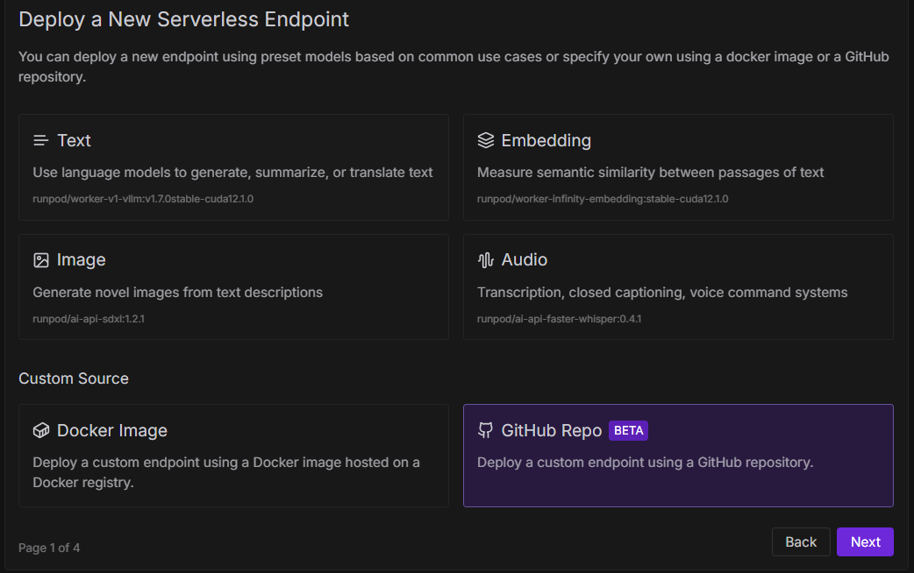
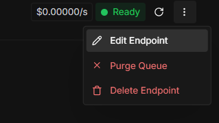

<div align="center">

# Flux worker
</div>

### Set Up:
* Create Serverless Endpoint

Well, for me i can use github repo mode. but not sure if others can.

if not possible to use this, then you'll need to build, upload the docker image to a registry. then create template 
  in RunPod.

* Environment Variables

```bash
# S3 Bucket
BUCKET_ENDPOINT_URL =  # S3 bucket endpoint url
BUCKET_ACCESS_KEY_ID =  # S3 bucket access key id
BUCKET_SECRET_ACCESS_KEY =  # S3 bucket secret access key
```

> [!NOTE]
> Some screenshots to help:



> [!NOTE]  
> **You can use secrets too!**


* **Input:**
```json
{
  "input": {
    "prompt": "Hello World",
    "width": 1024,
    "height": 1024,
    "num_outputs": 1,
    "num_inference_steps": 4,
    "guidance_scale": 2,
    "seed": 0
  }
}
```
> [!IMPORTANT]
> For now, you must use the whole inputs, complete without anything missing
> * there seems to be a bug in the **RunPod sdk**

